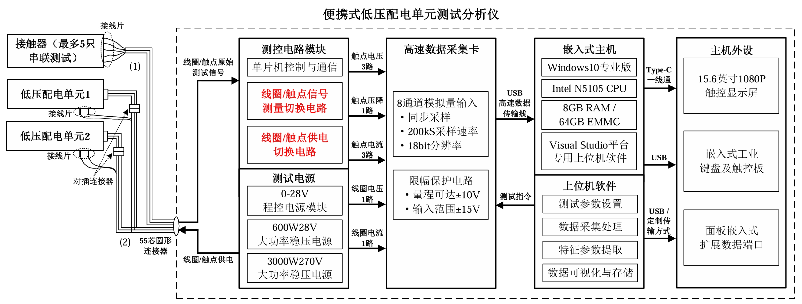
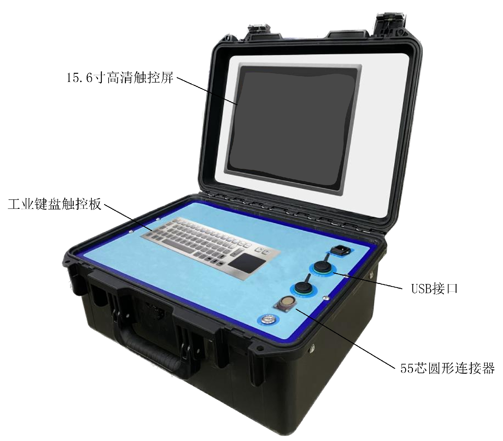

# 便携式低压配电单元测试分析仪设计方案

> **主控板**

> **测试板**

> **测试分析仪外观**

## 1\. 功能及技术指标

**（1）测试分析仪可测试直流型接触器动作过程的电信号**，包括：线圈电压、线圈电流、触点电压、触点电流、触点压降。直流型接触器动作过程电信号测试技术指标如表1所示。

表1 直流型接触器动作过程电信号测试技术指标

| **测试信号** | **技术指标** |
| --- | --- |
| 线圈电压 | 测量范围：DC 0-40V，精度10mV |
| 线圈电流 | 测量范围：DC 0-10A，精度5mA |
| 触点电压/压降 | 主触点：测量范围：DC 0-300V，精度50mV  辅助触点：测量范围：DC 0-40V，精度10mV |
| 触点电流 | 测量范围：DC 0-15A，精度5mA |

**（2）测试分析仪可测试直流型接触器的综合特性参数**，包括：动作参数（吸合/释放时间、动断/动合时间、回跳时间）、燃弧时间、接触电阻、吸合/释放电压、线圈电阻。直流型接触器综合特性参数测试条件及技术指标如表2所示。

表2 直流型接触器综合特性参数测试条件及技术指标

| **测试参数** | **测试条件** | **技术指标** |
| --- | --- | --- |
| 动作参数（吸合/释放时间、动断/动合时间、回跳时间） | 主触点施加6V/1A测试电压/电流，辅助触点施加6V/100mA测试电压/电流，线圈上电28V | 测量范围：0-100ms，  分辨率5μs |
| 燃弧时间 | 主触点施加270V/10A测试电压/电流，辅助触点施加28V/5A测试电压/电流，线圈上电28V | 测量范围：0-100ms，  分辨率5μs |
| 接触电阻 | 主触点施加6V/1A测试电压/电流，辅助触点施加6V/100mA测试电压/电流，线圈上电28V | 测量范围：1mΩ-1Ω，  精度0.1mΩ |
| 吸合/释放电压 | 主触点施加6V/1A测试电压/电流，辅助触点施加6V/100mA测试电压/电流，线圈上电0-28V（阶跃函数法/电压斜线上升法） | 测量范围：DC 0-40V，  精度10mV |
| 线圈电阻 | 线圈上电28V | 测量范围：100mΩ-100Ω，  精度10mΩ |

（3）针对单独接触器，测试分析仪可通过一端引出接线片的测试线缆进行测试，并可同时连接5只接触器，给其中2只接触器线圈上电，并测试其中1只接触器参数；每只接触器支持测试3路触点信号，其中主触点1路、辅助触点2路；通过轮询方式可最多串联测试5只接触器参数。

（4）针对具有辅助触点的接触器，测试分析仪具有自动提取主触点与辅助触点动作时间差、分析二者同步动作配合关系的功能。

（5）测试分析仪应用Windows10专业版系统嵌入式主机、箱体面板设计有一体化工业键盘和触控板、箱体上盖设计有15.6英寸触控显示屏，上位机软件稳定可靠，具有简洁大方、功能强大的人机交互界面。

（6）测试分析仪供电方式为AC220V市电供电。

（7）测试分析仪外型尺寸不大于500\*400\*250(mm)，质量不大于10kg。

（8）测试分析仪可对测试的线圈及触点性能参数和原始波形进行存储、回放、分析。

## 2\. 总体设计方案

测试分析仪总体设计方案如图1所示。测试分析仪设计简洁、轻便紧凑、功能全面、交互友好，具备直流低压电器综合特性参数及低压配电单元动作特性的测试能力。总体设计方案分为测控电路模块、测试电源、高速数据采集卡、嵌入式主机和外设、上位机软件五大部分。测试分析仪通过箱体面板的圆形连接器端口和按需定制的测试线缆，由测试电源为直流低压电器及低压配电单元对应线圈/触点施加电压，并采集线圈/触点原始测试信号传输至测控电路模块。高速数据采集卡采集3路触点电压、1路触点压降、3路触点电流、1路线圈电压及1路线圈电流，并通过USB高速数据传输线传输至嵌入式主机。配套搭载的基于Visual Studio开发的专用上位机软件具有计量校准功能，实时完成测试参数设置、数据采集处理、特征参数提取、数据可视化与存储等功能。使用者可通过嵌入箱体上盖的触控显示屏及嵌入箱体面板的工业键盘触控板实现简洁、友好的人机交互，并通过嵌入面板的扩展数据端口把测试结果导出至其他存储介质、计算机或数据库进行分析及管理。

图1 总体设计方案

图2 外观效果图

## 3\. 触点、线圈测量供电切换电路设计方案

为满足最多5只接触器的串联测试，设计的接触器触点供电切换电路如图3所示。在燃弧时间测试模式下，主触点供电270V/10A、辅助触点供电28V/5A；在特性参数测试模式下，主触点供电6V/1A，辅助触点供电6V/100mA。每只接触器上电时，可同时为1对主触点和2对辅助触点回路供电。

图3 接触器触点供电切换电路

设计的触点压降测试切换电路如图4所示。测试分析仪在尽可能靠近触点位置采集并测试触点压降。针对主触点，由于需承受高负载电压（270V），采用继电器阵列选择待测触点压降；针对辅助触点，由于承受较低负载电压（28V），考虑优化电路设计、节约空间、降低干扰，采用多路模拟选择开关芯片选择待测触点压降。

图4 接触器触点压降测试切换电路

设计的线圈供电切换电路如图5所示。测试分析仪最多可给2只接触器上电，并测试其中一只接触器参数。

图5 接触器线圈供电切换电路

## 4\. 线缆、连接器接口定义设计方案

针对5只接触器串联测试，采用的线缆一端为连接测试分析仪箱体的55芯圆形连接器，另一端为连接最多5只接触器引出端的接线片，满足防串扰、绝缘、电磁屏蔽等要求。提供的接口类型和数量如表4所示。

表4 接触器串联测试线缆连接器接口类型和数量

|     | **数量   （每只接触器）** | **引出端数量   （每只接触器）** | **总计接口数量   （5只接触器）** |
| --- | --- | --- | --- |
| **线圈** | 1个  | 2个  | 10个 |
| **主触点** | 1对  | 2个  | 10个 |
| **辅助触点** | 2对  | 6个  | 30个 |
| **总计** | \-  | 10个 | 50个 |
